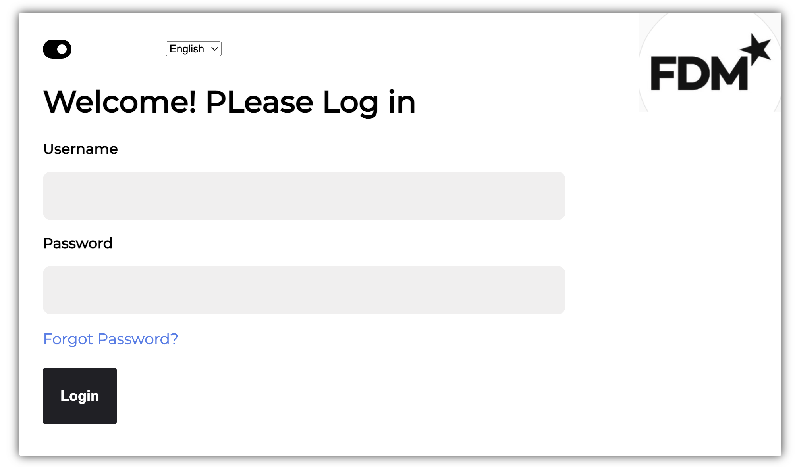
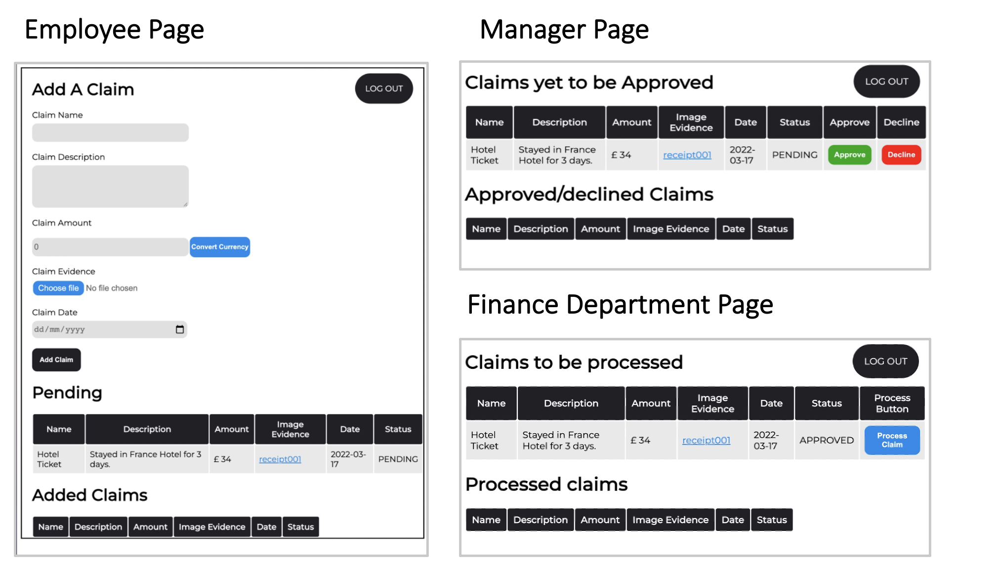
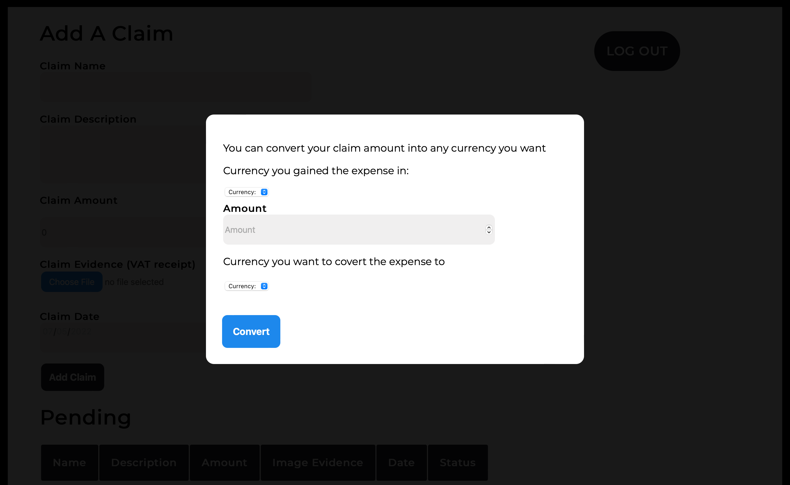
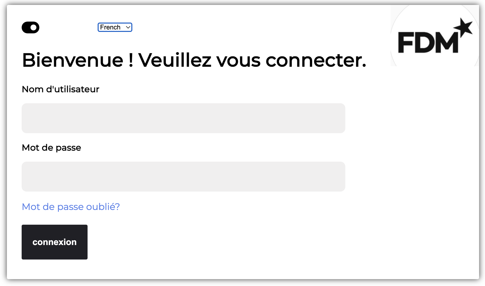
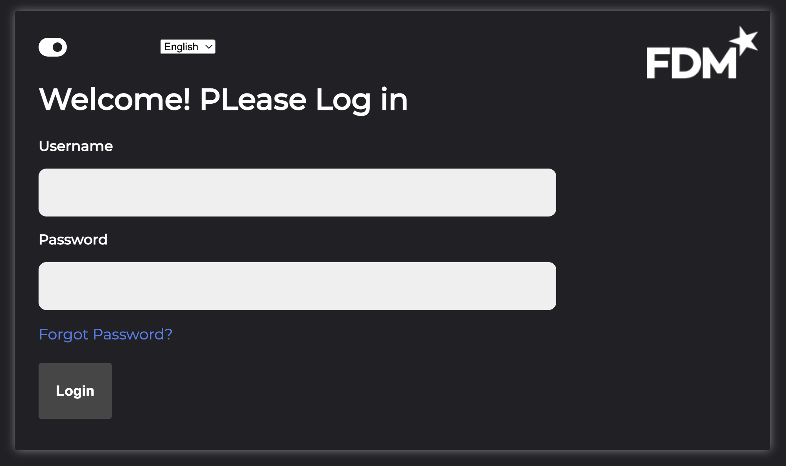

<!-- Please update value in the {}  -->

<h1 align="center">FDM Expense App</h1>

<!-- 

   Solution for a challenge from  <a href="http://devchallenges.io" target="_blank">Devchallenges.io</a>.

 -->

  <h3>
    <!-- <a href="#"
    target="_blank">
      Live Demo
    </a> -->
    <!--  | 
    <a href="https://github.com/favour33/error-404">
      Code 
    </a> -->
    <!--  | 
    <a href="https://devchallenges.io/challenges/wBunSb7FPrIepJZAg0sY">
      Challenge
    </a> -->
  </h3>

<!-- TABLE OF CONTENTS -->

## Table of Contents

- [Overview](#overview)
- [Built With](#built-with)
- [Features](#features)
- [Contact](#contact)
- [Acknowledgements](#acknowledgements)

<!-- OVERVIEW -->

## Overview

 

<h2>Login Page</h2>

 
 
<h2>Employee/Manager/Finance Department Pages</h2>

 
 
<h2>Convert Currency Pop-up</h2>

 
 
<h2>Mutli-language Support</h2>

 
 
<h2>Dark mode Page</h2>

 

### Where can I see a live demo?

As FDM is a real company i cannot host a live demo of the application however screenshots are Provided above.

 

### What was my experience?  

In a software engineering module I took, I was given a problem by a real company (FDM) and had to create a software solution for expense claims. From the problem definition I created user stories, from the user stories I was able to do the UX and creating user flows and the UI design including colour themes and ensuring accessibility.

After that I began prototyping and created an application. After reviewing the application with the FDM clients I got feedback, from the feedback I was able to plan, design then further implement the features asked for. After all user stories were complete, I went further and added extra features that Imagined would benefit the users such as forgot password, currency convertor, multi-language support and light/dark mode.

 

### What have i learned/improved? 

 

- Design/ Colour themes
- Planning Features
- Talking to stakeholders
- Integrating Firebase Backend

 

## Built With

<!-- This section should list any major frameworks that you built your project using. Here are a few examples.-->

- ReactJS
- Firebase
- CSS

 

## Features

<!-- List the features of your application or follow the template. Don't share the figma file here :) -->

- Login Page
- Forgot Password
- Add an Expense Claim
- View Expense Claim
- Convert Currency
- Approve Expense Claim
- Decline Expense Claim
- Process Expense Claim
- Mutli-language support
- Light/Dark Mode

 

## Acknowledgements

<!-- This section should list any articles or add-ons/plugins that helps you to complete the project. This is optional but it will help you in the future. For exmpale -->

- [FDM Website](https://www.fdmgroup.com)
- [Firebase with React](https://www.pluralsight.com/guides/using-firebase-with-react-and-redux)

- [Design Guide](https://www.checklist.design)

 

## Contact

<!-- - Website [your-website.com](https://{your-web-site-link}) -->

- GitHub [@favour33](https://github.com/favour33)
- linkedin [@Favour Nwachukwu](https://www.linkedin.com/in/fn84/})
